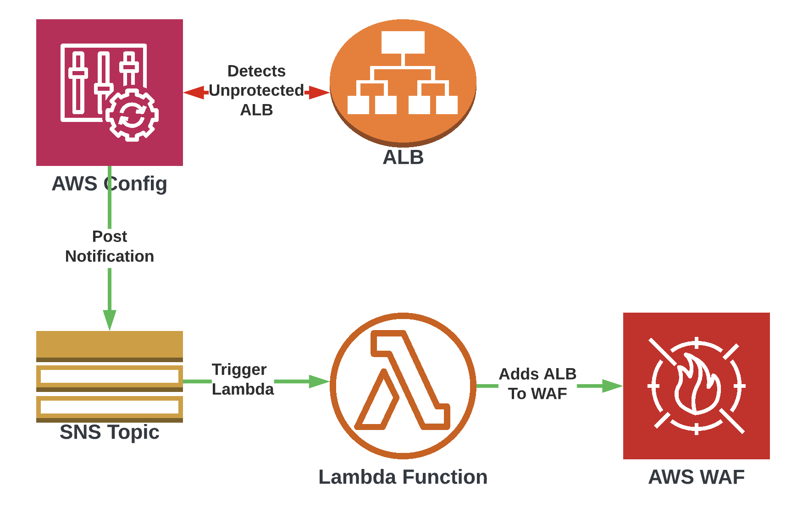
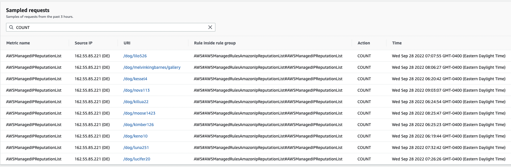

# Web AWS WAF ACL

This is an implementation of the AWS WAF for AWSS accounts using the AWS CDK (typescript) as the configuration language.

## Diagram

## Features

The AWS WAF WebACL service takes advantage of AWS Config service compliance rules to determine if a given application load balancer is configured with a web application firewall (WAF). If not, using the AWS Config console, a noncompliant ALB can be remediated at the click of a button which will notify the WAF Updater Lambda function of the noncompliant ALB to be processed and included as a protected resource in the WAF configuration.

The WAF is configured with AWS managed rulesets which enforce a "best practices" approach to web application security. These cover a variety of security concerns such as cross-site scripting (XSS), SQL injection, common requests known to be utilized by malicious actors, and IP reputation, and many more. These rulesets are maintained by AWS and updated frequently in response to new attacks and security considerations.

- [AWSManagedRulesCommonRuleSet](https://docs.aws.amazon.com/waf/latest/developerguide/aws-managed-rule-groups-baseline.html) - The Core rule set (CRS) rule group contains rules that are generally applicable to web applications. This provides protection against exploitation of a wide range of vulnerabilities, including some of the high risk and commonly occurring vulnerabilities described in OWASP publications such as [OWASP Top 10](https://owasp.org/www-project-top-ten/).
- [AWSManagedRulesKnownBadInputsRuleSet](https://docs.aws.amazon.com/waf/latest/developerguide/aws-managed-rule-groups-baseline.html#aws-managed-rule-groups-baseline-known-bad-inputs) - The Known bad inputs rule group contains rules to block request patterns that are known to be invalid and are associated with exploitation or discovery of vulnerabilities. This can help reduce the risk of a malicious actor discovering a vulnerable application.
- [AWSManagedRulesAmazonIpReputationList](https://docs.aws.amazon.com/waf/latest/developerguide/aws-managed-rule-groups-ip-rep.html#aws-managed-rule-groups-ip-rep-amazon) - The Amazon IP reputation list rule group contains rules that are based on Amazon internal threat intelligence. This is useful if you would like to block IP addresses typically associated with bots or other threats. Blocking these IP addresses can help mitigate bots and reduce the risk of a malicious actor discovering a vulnerable application.
- [AWSManagedRulesSQLiRuleSet](https://docs.aws.amazon.com/waf/latest/developerguide/aws-managed-rule-groups-use-case.html#aws-managed-rule-groups-use-case-sql-db) - The SQL database rule group contains rules to block request patterns associated with exploitation of SQL databases, like SQL injection attacks. This can help prevent remote injection of unauthorized queries.

[AWS Config](https://docs.aws.amazon.com/config/latest/developerguide/WhatIsConfig.html) is used to identify unprotected application load balancers with the [alb-waf-enabled](https://docs.aws.amazon.com/config/latest/developerguide/alb-waf-enabled.html) managed rule.
When AWS Config detects the violation of the alb-waf-enabled rule and flags the resource (ALB) as *noncompliant*, the offending resource can be easily identified via the consoleand remediated by clicking the "remediate" button. This sends a notification to SNS that contains the resource ARN. The SNS topic is subscribed-to by a Lambda function which parses the resource ID and adds it to the WAF Web ACL.

Each protected environment hosts a CloudWatch log group, `aws-waf-logs-awswafwebacl-${environment}`, which records all sampled traffic and can be reviewed for troubleshooting purposes. In addition to the CloudWatch log group, any sampled requests in a 3 hour window can be viewed directly in the AWS Console under the approriate web ACL in the WAF section.

This shows what rule(s) have been violated, source IP, the action taken ([Allow/Count/Block](https://docs.aws.amazon.com/waf/latest/developerguide/waf-rule-action.html)), and the time stamp of the request processed. It is *highly* recommended that close attention is paid to this log and any undesired rules or misconfiguration of the affected application be remedied as soon as possible.
